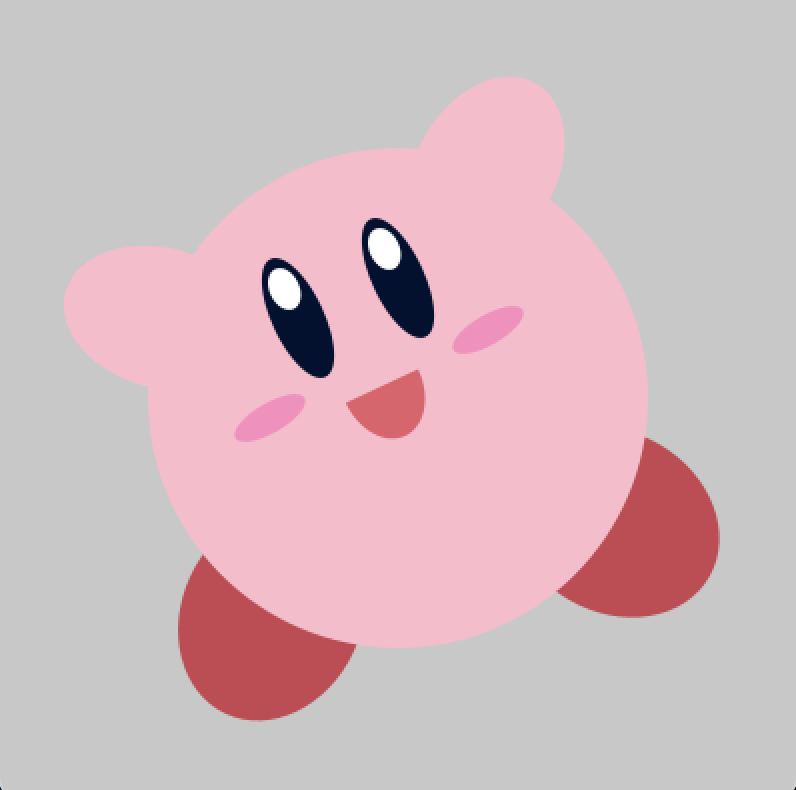
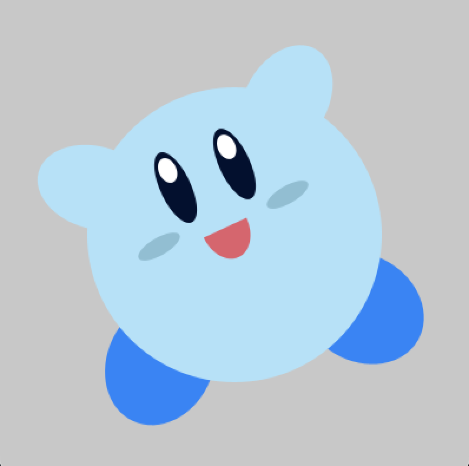
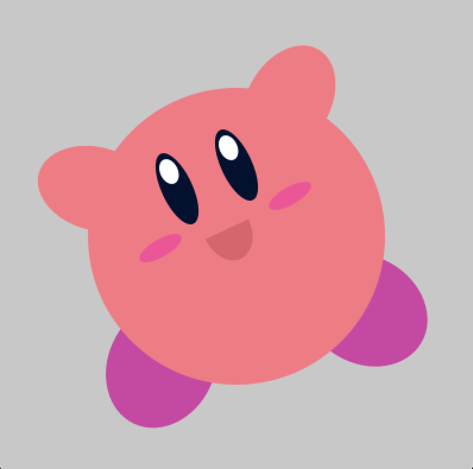
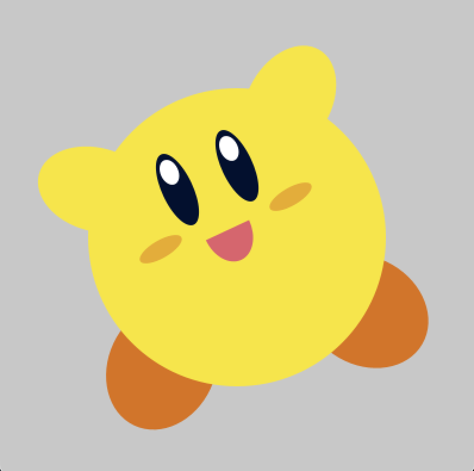
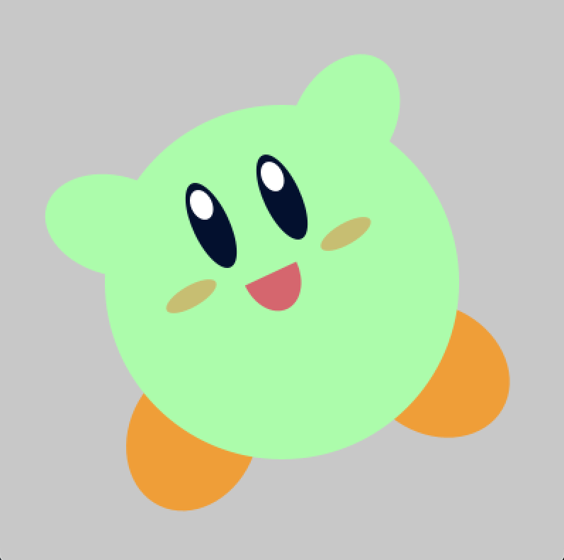
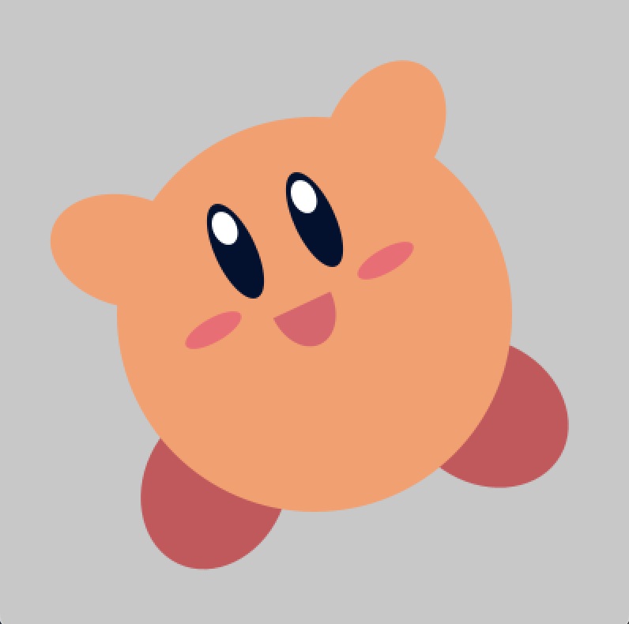
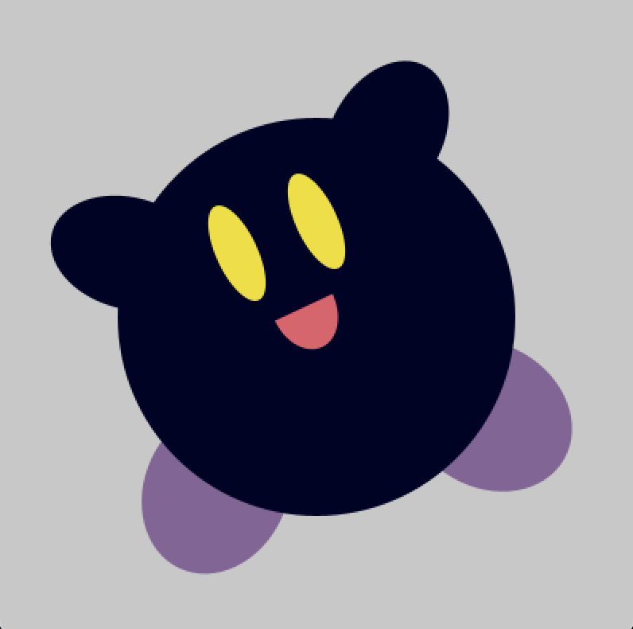

# interactive kirby portrait
### mac's assignment 2 - CC python 
for this assignment i used the py5 framework to make a portrait of kirby (from the popular nintendo video game series.)
i wanted to add variation to this sketch, so i added an interaction that makes kirby's color palette switch when the user clicks on the screen, with each click randomly choosing from any of the possible color combinations.
below are images of all of the possible colors.
to see it in action, you can see the video linked in "visualDocumentation" or download the script and run it yourself!

[temporary video hosting](https://streamable.com/5vix8u)
