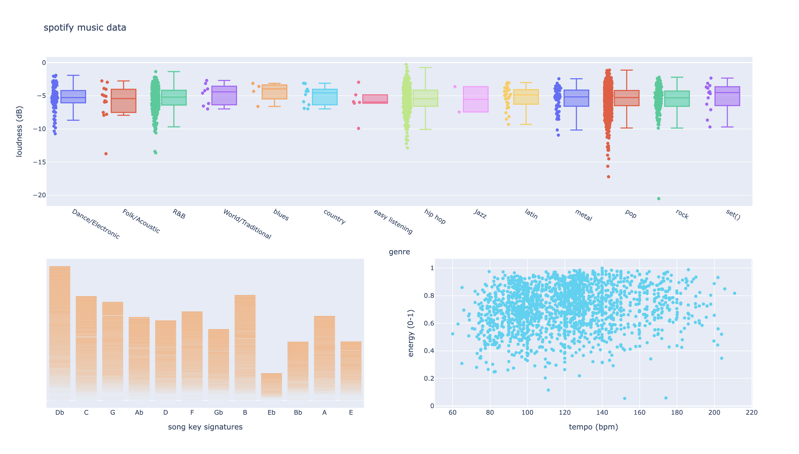
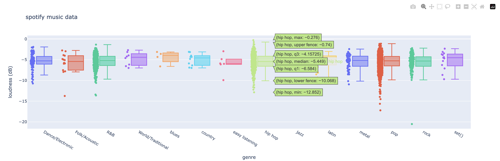
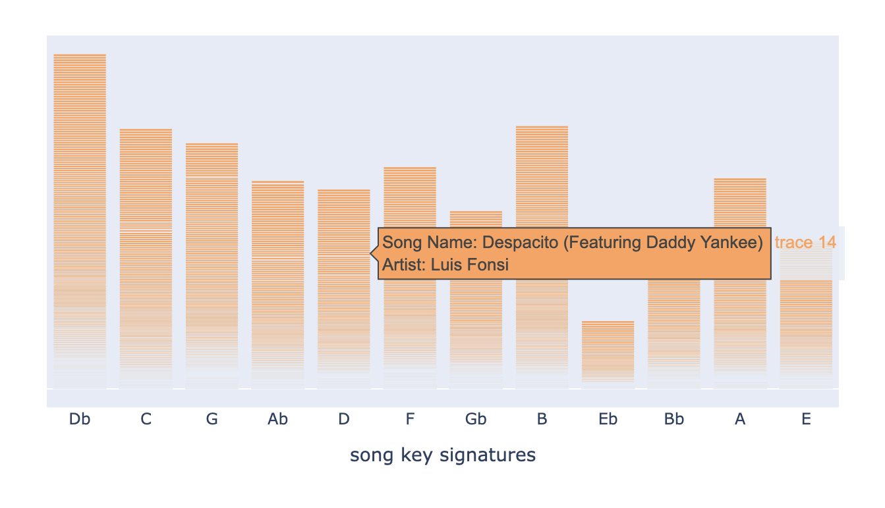

# Assignment 6 - spotify data vis
## mac sanmiguel
for this assignment, I found a [dataset](https://www.kaggle.com/code/varunsaikanuri/spotify-data-visualization/input) from kaggle that has information about the most popular songs on spotify. 

The data points that I explored were loudness, tempo, energy, key, genre, song name, and artist name. 

The first thing i made was box plots that show the loudness of each genre in decibels. The distribution of songs across genre is heavily weighted towards pop, r&b, and rock, so it's hard to determine how genre affects loudness. It is interesting how the mean loudness of all the songs across genre is generally the same.
I also made a simple scatter plot that shows the correlation between "energy" and tempo. according to the source of my dataset, the energy datapoint "represents a perceptual measure of intensity and activity." This seems like a pretty relative/subjective thing to me, but I thought that there might be some interesting relation to tempo, as higher tempos are often seen as being higher energy.

I also thought it might be fun to make a little interactive bar chart where you can see how many songs were written in each key. When you hover over each of the bars, you will see the name of the song and artist. 
