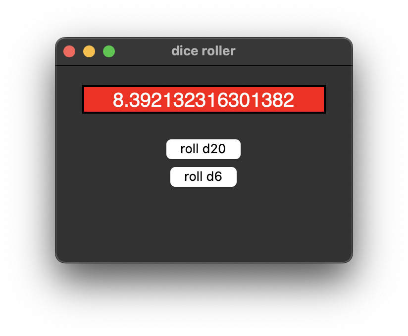

# tkinter "stuid ui" dice roller
## mac sanmiguel wk 13

This week I decided to modify one of the examples we worked on in class to make a "stuid ui" example. I took the dice roller program, and added a couple options of different types of dice. The thing that I changed to make it "stupid ui" is that each time you press the button, the number that comes out is not an integer within the range of the dice (which is what you'd expect), it actually returns a floating point number, which is completely necessary when you want to roll a die (hahahhahahhahahahhahahahhhahahhahahhahahahhahahhahahahhahahahhahahhahahahhahahahhahahhahahahhahahahhahahhah). alright, thats it. heres some photos:

