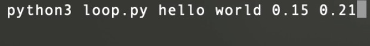

# make-your-own sine waves
## mac sanmiguel assignment 3 - cc python
I modified one of Al Sweigart's examples of scroll art [(from his GitHub repo)](https://github.com/asweigart/scrollart/tree/main/python) that features a visualization of a sine function. I decided to add on a few things in the original script. First, I added a second sine wave, that went in the opposite direction, then I added another layer of user interaction, allowing the python file to be run with four arguments. The first and second arguments are strings that become the text displayed for each wave, and the third and fourth argument are floating point numbers that affect how quickly each wave oscillates. 
example of running the file with four arguments:

when no arguments are passed, or only some are, the remainder will be filled in with predetermined values

