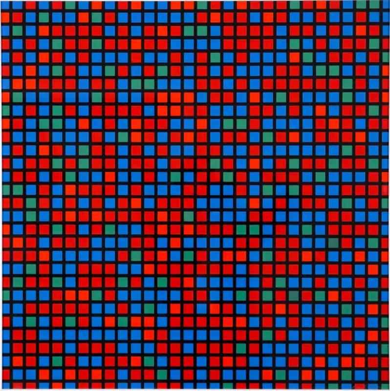
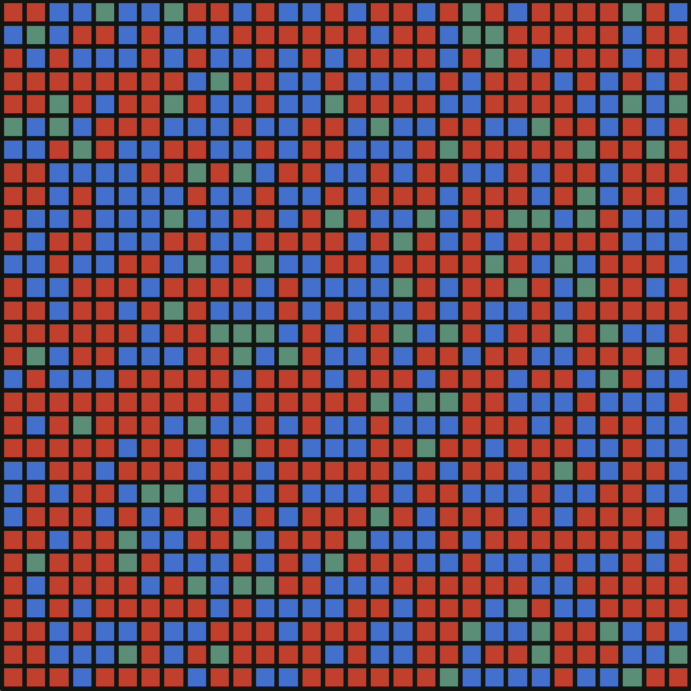
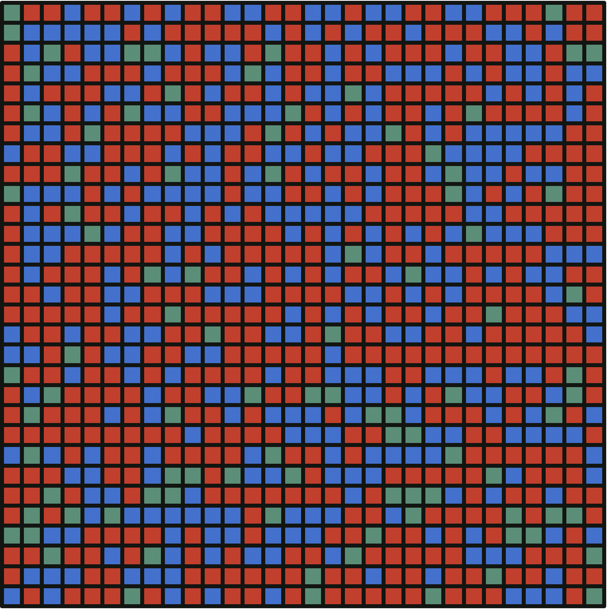

# François Morellet - Chartres - bleu rouge
## mac sanmiguel - assignment 4 cc python
This week I used python's [turtle](https://docs.python.org/3/library/turtle.html) library to recreate Morellet's "Chartes - bleu rouge"

the original art piece:

By using python's random library, I made it so that each time you run the program, you will get a slightly different result.

## Visual documentation:

cool gif :D

example 1:

example 2:

