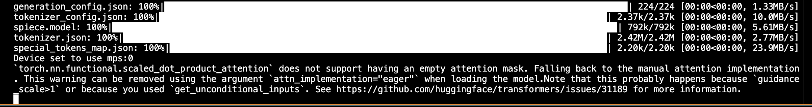

# assignment 8 - use LLMs 
## mac sanmiguel

this week we're running ai models from hugging face locally on our computers. I decided to go with a model that converts text to audio because that sounded interesting to me [(musicgen-small)](https://huggingface.co/facebook/musicgen-small). I used the code that was available on the hugging face page to get started out. the following code is their simplest example, but I ran into a problem when trying to run it.
```
from transformers import pipeline
import scipy

synthesiser = pipeline("text-to-audio", "facebook/musicgen-small")

music = synthesiser("lo-fi music with a soothing melody", forward_params={"do_sample": True})

scipy.io.wavfile.write("musicgen_out.wav", rate=music["sampling_rate"], data=music["audio"])
```

There was another example using a different method, and although I got the same error, it ended up working out anyways. This is the code I ended up using:
```
from transformers import AutoProcessor, MusicgenForConditionalGeneration

processor = AutoProcessor.from_pretrained("facebook/musicgen-small")
model = MusicgenForConditionalGeneration.from_pretrained("facebook/musicgen-small")

inputs = processor(
    text=["80s pop track with bassy drums and synth", "90s rock song with loud guitars and heavy drums"],
    padding=True,
    return_tensors="pt",
)

audio_values = model.generate(**inputs, max_new_tokens=256)
```
and i added a couple more lines that allowed me to write the result to a wav file:
```
import scipy

sampling_rate = model.config.audio_encoder.sampling_rate
scipy.io.wavfile.write("musicgen_out.wav", rate=sampling_rate, data=audio_values[0, 0].numpy())
```
i made a folder in this repo where you can see my inputs and results:
[folder](https://github.com/macizen/pyClassRepo/tree/main/use-llms/results)
